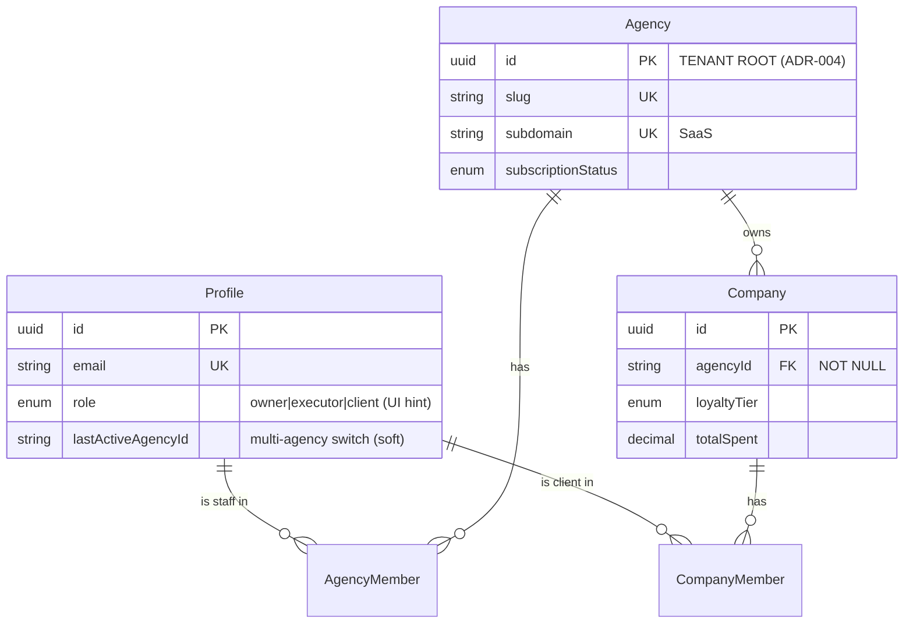
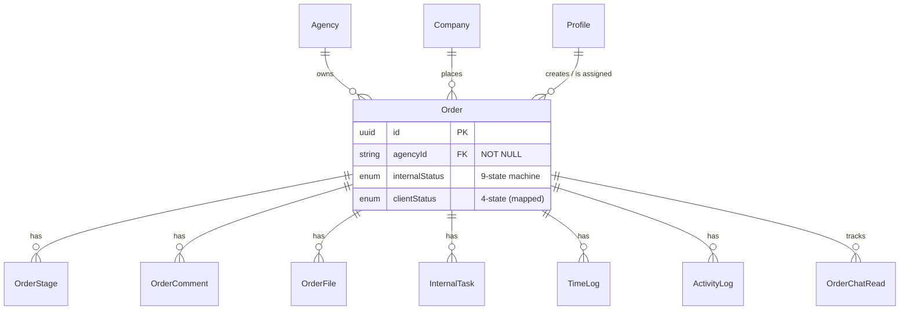
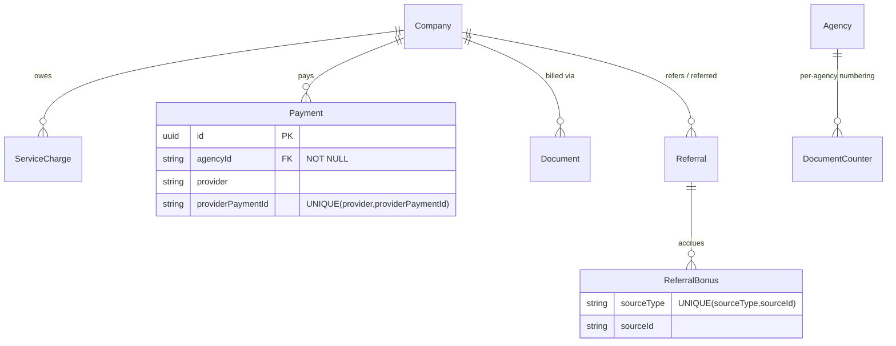
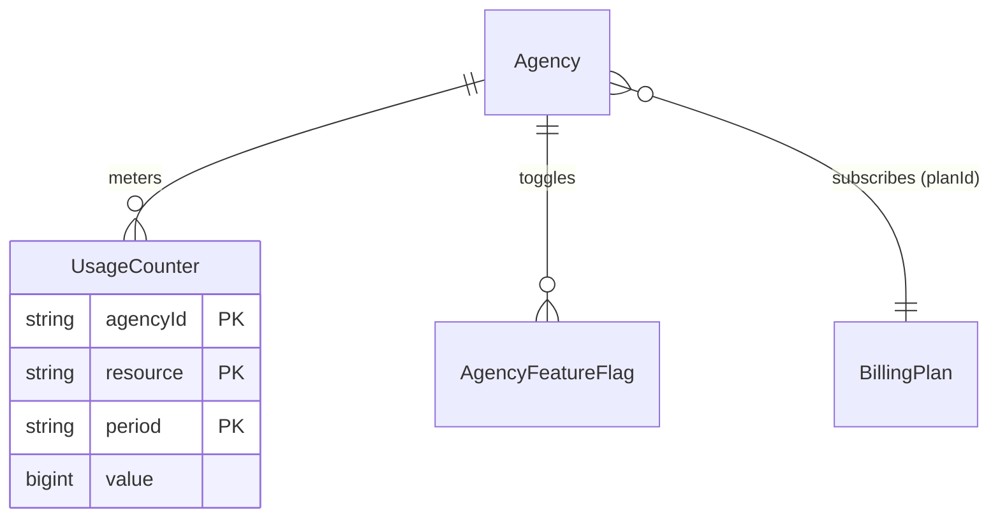

# WORKFLO.SPACE — Data Model (ERD)

> Створено: 7 червня 2026 (аудит) · Оновлено: 12 липня 2026 · Канон схеми — `packages/db/prisma/schema.prisma`.
> Це оглядова мапа **ядра tenant-графа** (не всі 84 моделей) — для онбордингу й
> розуміння меж мультитенантності. Деталі полів — у схемі.
>
> **Дельта S5.5 (11.06.2026, AR-20/21/22):** `Referral` тепер несе власний
> `agencyId` (NOT NULL, column-RLS замість referrer-join політики);
> `ExecutorPayout` unique = `(agencyId, executorId, period)`; `Company.slug`
> unique per-agency `(agencyId, slug)`. Діаграми нижче це відображають
> концептуально; точні констрейнти — у схемі (канон).

## Tenant root + identity

- **`Agency` = tenant root.** Every agency-scoped table carries `agencyId` (direct
  column, or parent-join for order/company children). RLS isolates on it (F4).
- **`Profile` = global identity** (one login across agencies). Staff membership =
  `AgencyMember`; client membership = `CompanyMember`. The session's active tenant is
  `activeAgencyId` (JWT claim), switchable via `/auth/switch-agency`.

## Order graph (the work core)

- Internal↔client status: `OrderInternalStatus` (9) → `OrderClientStatus` (4) via
  `INTERNAL_TO_CLIENT_STATUS`; transitions gated by `ALLOWED_ORDER_TRANSITIONS`.
- Order children (`OrderComment/OrderFile/InternalTask/TimeLog/ActivityLog`) now carry
  a NOT NULL `agencyId` (Block 1) so no row falls outside its tenant under RLS.

## Financial graph (S5 — partially modelled)

- **Idempotency at the DB layer** (Block 1): `Payment(provider, providerPaymentId)` for
  webhook dedup; `ReferralBonus(sourceType, sourceId)` for accrual dedup.
- **Modelled (S5.6):** `WalletTransaction`, `PaymentAllocation`, `Expense` ledger (all
  with `agencyId NOT NULL` + idempotency keys).

## SaaS / platform tables

- `UsageCounter` + `AgencyFeatureFlag` (Block 1) are the substrate the F2 quota/feature
  seam (`assertWithinQuota` / `featureEnabled`) reads once SaaS enablement lands.

## Recent models (post-S6)

- **Team & Leave:** `Team`, `TeamColumn` (kanban boards), `LeaveRequest` (баланс відпустки — обчислюваний, НЕ таблиця; accrual від `AgencyMember.hireDate`)
- **Content & Testimonials:** `BlogPost`, `Testimonial`, `Announcement`
- **Notifications:** `PushSubscription`, `Broadcast`, `EmailSuppression`
- **Orders:** `OrderDependency` (cycle-guard + gantt dependencies)
- **Files:** `OrderFile.thumbKey` (webp thumbnail storage key for S10-06)

**New columns (2026-07):**

- `LegalEntity.{docKit, bic, incomeTaxPct}` — tax per legal entity per-channel
- `Payment.legalEntityId` — ties payment to entity for income tax accrual
- `TicketMessage.sourceMessageId` — email inbound dedup
- `OrderFile.thumbKey` — webp thumbnail for inline preview
- `AgencyMember.hireDate` — leave accrual base
- `Agency.vacationDaysPerYear` — vacation accrual policy
- `PushSubscription` — identity-scoped (profileId only, **no** agencyId/RLS, як `RefreshToken`)
- `Profile.{phone, timezone}` — contact + IANA timezone (S9-06); timezone validated via `Intl`
- `EmailSuppression { email @unique, reason, source? }` — identity-scoped (**no** agencyId/RLS,
  scoped by email like `RefreshToken`); reason `bounce` (DSN-detect) / `unsubscribe` (HMAC token);
  `notify()` skips EMAIL when suppressed (S12-05)

## NOT tenant-scoped (no RLS — global/identity)

`Profile`, `RefreshToken`, `PasswordResetToken`, `OtpToken`, `NotificationSettings/
Preference/Log`, `Notification`, `BillingPlan`, `ContactForm`, `Agency`, `AgencyMember`,
`PushSubscription`, `EmailSuppression`.
These are read without the tenant wrapper (identity/auth paths) by design.
