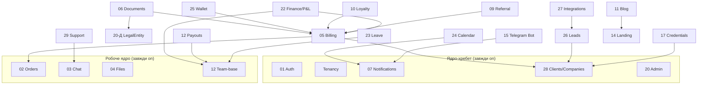

# ADR-008: SaaS Module Packaging & Access (entitlement-gated monolith)

**Статус:** Прийнято · **Дата:** 12 червня 2026
**Контекст:** Власник хоче, щоб у SaaS-фазі модулі можна було вмикати/вимикати per-тенант,
з залежностями між ними, для різних тарифів («комусь не треба лендінг / портал / частину
воркспейсу»). Питання — який рівень модульності закладати ЗАРАЗ, щоб не переробляти потім,
без переінженерингу. Закриває аналітичний таск **AN-1 (переосмислення ролей)** разом із
пакуванням, бо доступ = (план→модулі) × (роль→права). Рішення прийняті вікториною 12.06.

---

## Рішення

**Entitlement-gated modular monolith.** Один моноліт (ADR-005 лишається), а «модульність» —
це **рівень прав доступу (entitlements) + дані**, НЕ плагінна архітектура.

> Модуль вимикається не вийманням коду, а **невимкненим фіч-флагом** (`AgencyFeatureFlag`)
> і непровіжиненою поверхнею. Код один; поведінка — за даними плану. Плагіни / динамічне
> завантаження — свідомо ВІДХИЛЕНО (дорого, складно підтримувати, переінженеринг для
> однокомандного продукту).

### Що вже є (фундамент з аудиту — FDN-2, ~80%)

- `AgencyFeatureFlag { agencyId, flag, enabled }` — перемикач фіч per-тенант.
- `BillingPlan { slug, priceUsd, maxOrders, maxMembers, features Json }` — каталог планів.
- `featureEnabled(agencyId, flag)` + `assertWithinQuota()` — seam-и (зараз no-op).
- `agencyId` + RLS на всіх tenant-таблицях (ADR-004/007).

### Модель пакування

**Три класи модулів:**

1. **Ядро-хребет (core, вимкнути НЕ можна):** Auth(01), Tenancy, Settings(13),
   Notifications(07, cross-cutting), Clients/Companies(28-base), Admin(20), Search(16-scoped),
   Reports(19-base dashboard).
2. **Робоче ядро (work-core, завжди увімкнене — це сам продукт):** Orders(02), Chat(03),
   Files(04), Team(12-base).
3. **Опційні модулі (продаються тарифами/add-on'ами, мають залежності):** нижче граф.

**Граф залежностей (валідні набори = тарифи):**

**Рівень 3 апок (поверхні):**

| Поверхня      | Перемикання                    | Нотатка                                            |
| ------------- | ------------------------------ | -------------------------------------------------- |
| Landing (14)  | per-план флаг (можна вимкнути) | окремий деплой; «без лендінга» = не провіжимо сайт |
| Client Portal | per-план флаг (можна вимкнути) | «тільки внутрішні інструменти»-план = портал off   |
| Workspace     | **завжди on**                  | операторська поверхня — без неї продукту немає     |

### Тарифи = валідні підмножини графа (НЕ довільні тумблери)

Щоб уникнути комбінаторного вибуху тестування/підтримки — **не продаємо à-la-carte**.
Продаємо **3-4 наперед визначені тарифи + кілька add-on'ів**, кожен — валідний набір модулів.
Ілюстративна композиція (значення цін — окреме Phase-1 рішення, MoR ще відкритий):

| Тариф                          | Включає (поверх ядра+work-core)                                                             |
| ------------------------------ | ------------------------------------------------------------------------------------------- |
| **Starter**                    | Client Portal · базовий Billing (manual)                                                    |
| **Pro**                        | + повний Billing/Finance (Documents, Wallet, Loyalty, Referral, P&L) · Bot · Calendar/Leave |
| **Business**                   | + Leads/Integrations · Support · Credentials · API · custom-ролі · advanced auth (S9)       |
| **Add-on'и (будь-який тариф)** | Landing & Blog · додаткові seats/quota                                                      |

### Доступ = entitlements × ролі (AN-1 закрито)

Доступ користувача = **(план тенанта → увімкнені модулі) × (роль → права в модулях)**.

- **Ролі команди зараз (Ролі-1):** фіксований набір **owner / manager / executor**
  (+ manager: бачить замовлення/чати/клієнтів, без фінансів і налаштувань — 20-А).
  Повний RBAC-конструктор — пізніше.
- **Ролі SaaS-тенантів (Ролі-2):** предвизначені по плану; кастомні ролі — на вищих
  тарифах (Business) потім.
- **View-as / імперсонація (Ролі-3):** обидва рівні — owner бачить портал очима клієнта
  (20-Б, read-only + банер) + платформний super-admin імперсонує тенанта (SA-1, з аудит-трейлом).

## Що закладаємо ЗАРАЗ (SaaS-3 — мало, дешево; ретрофіт дорогий)

1. **ModuleRegistry як дані** (`@workflo/types`): `{ key, name, dependsOn[], appSurface, core }` —
   канонічний список модулів + граф залежностей в одному місці.
2. **Дисципліна гейту:** кожен НОВИЙ модуль (S5.6+) від першого дня гейтить роути + навігацію
   через `featureEnabled(agencyId, moduleKey)`. Seam уже є — користуватись завжди (як
   `agencyId`/RLS-дисципліна).
3. **`BillingPlan.modules`** — мапа план→набір модулів (можна через наявний `features Json`),
   валідується проти графа залежностей (увімкнути модуль → автоматично увімкнути його залежності).

## Що відкладаємо на SaaS Phase 1 (без міграції даних, безпечно)

UI вибору плану · super-admin призначення планів · MoR/білінг-інтеграція · значення лімітів ·
custom-ролі конструктор · платформна імперсонація UI. Усе — поверх готової схеми (SAAS.md E-серія).

## Що НЕ робимо ніколи

Плагінна архітектура · динамічне завантаження модулів · фізичне виймання коду · довільні
à-la-carte комбінації без валідації графа.

## Наслідки

- ✅ SaaS-пакування зводиться до даних (план→модулі) + дисципліни гейту — найдешевший шлях.
- ✅ Граф залежностей не дає продати невалідну комбінацію («Чат без Замовлень»).
- ✅ Наперед визначені тарифи обмежують матрицю тестування до жменьки конфігів.
- ⚠️ Кожен модуль-гейт — код-шлях у 2 станах: новий модуль додає тест «вимкнено → 403/прихований».
- ⚠️ ModuleRegistry стає каноном; розбіжність із кодом ловиться так само, як enum-drift (тест).

## Тригери перегляду

- 100+ тенантів із фізичною ізоляцією даних → переглянути shared-DB (вже в ADR-004).
- Запит на повністю кастомні per-тенант модулі (не з каталогу) → конструктор замість каталогу.

## Звʼязані

ADR-004 (multi-tenancy) · ADR-005 (modular monolith) · ADR-007 (RLS) · `SAAS.md` (E-серія) ·
`OPEN_QUESTIONS_2026-06.md` (SaaS/Ролі/Юр — закрито) · `MODULE_REVIEW_2026-06.md` (AN-1).
